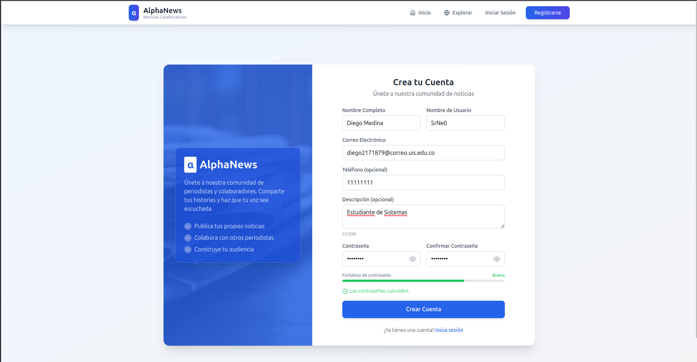
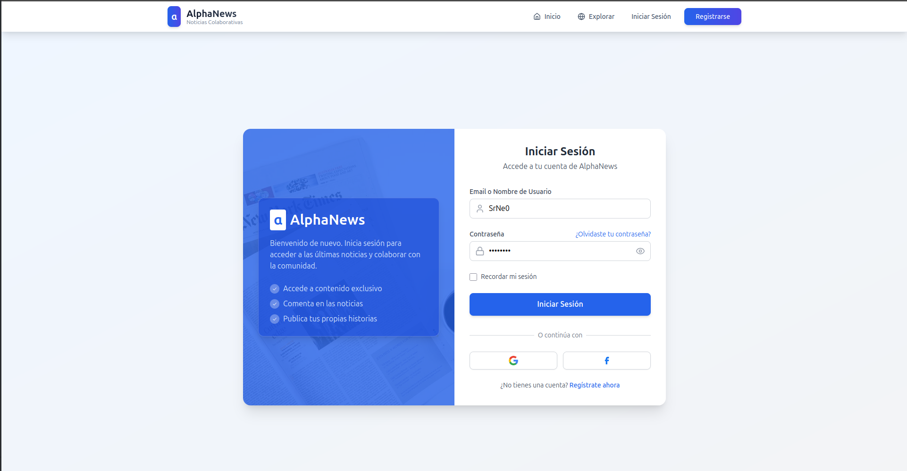
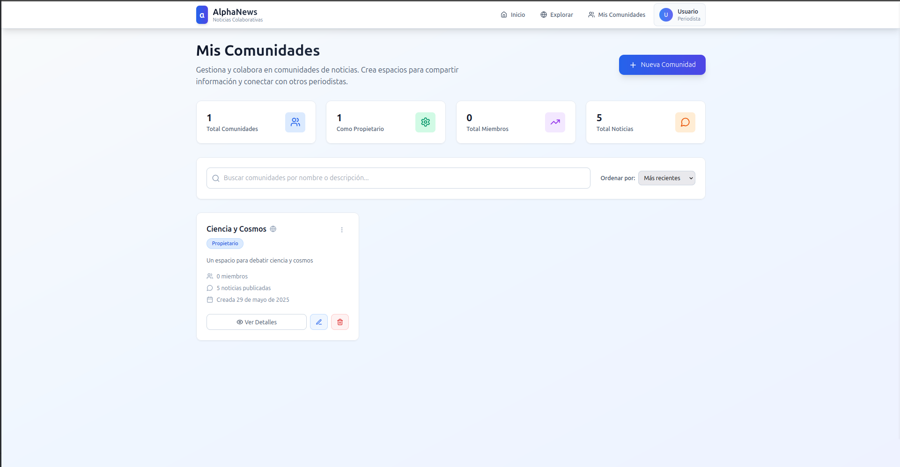
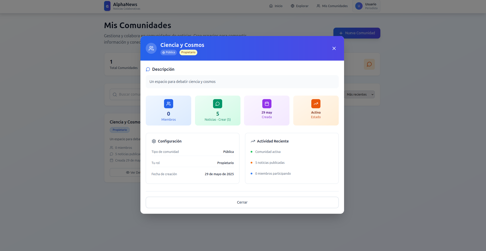
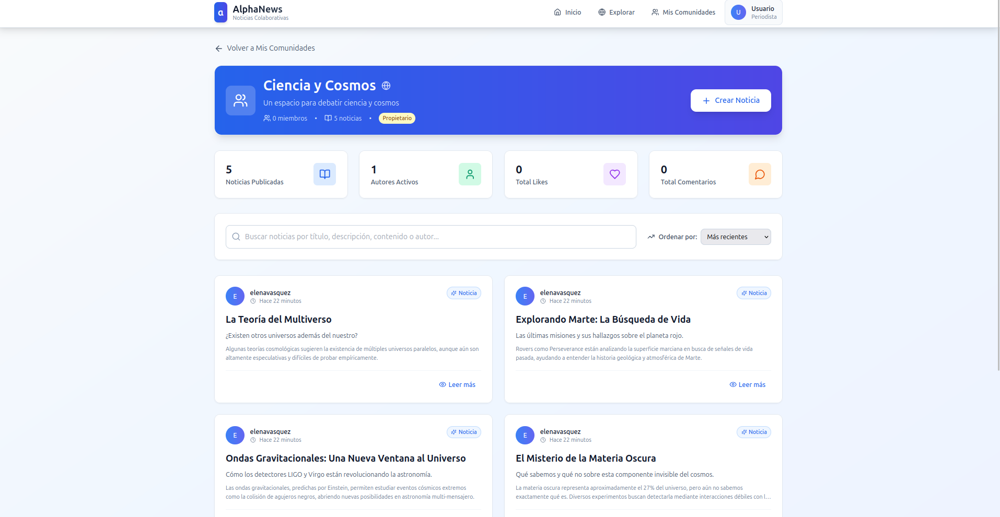
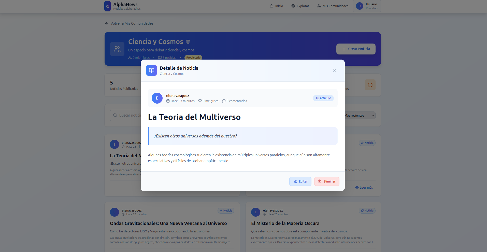

# AlphaNews - Frontend

El frontend de **AlphaNews** es una aplicación moderna construida con React y Vite, diseñada para ofrecer una plataforma de noticias colaborativa, rápida e interactiva.

## 👥 Autores

* **2211629** - Nestor Javier Clavijo Hernandez
* **2211593** - Jesus David Ramirez Celis
* **2171879** - Diego Armando Medina Ortega

## 🚀 Características Principales

* **Sistema de Autenticación Completo**: Registro de usuarios con validación, inicio de sesión basado en tokens (JWT) y persistencia de sesión.
* **Rutas Protegidas**: Uso de rutas públicas y privadas para controlar el acceso al contenido.
* **Gestión de Comunidades (CRUD)**: Funcionalidad completa para crear, editar y eliminar comunidades.
* **Exploración de Contenido**: Vistas globales para explorar todas las comunidades y noticias de la plataforma.
* **Interacción Social**: Sistema de calificaciones (likes/dislikes) y sección de comentarios en las noticias.
* **Paneles de Usuario**: Páginas dedicadas para la gestión de perfiles y comunidades personales.
* **Interfaz Responsiva**: Diseño adaptado a dispositivos móviles y de escritorio usando Tailwind CSS.

## 🧰 Stack Tecnológico

* **Framework**: React (v18+) con Vite
* **Enrutamiento**: `react-router-dom`
* **Estilos**: Tailwind CSS
* **Peticiones HTTP**: `axios` y `fetch`
* **Iconos**: `lucide-react`
* **Gestión de Estado Global**: React Context API

## ⚙️ Prerrequisitos

* Node.js (versión 18.x o superior)
* npm o yarn
* Servidor del backend activo y accesible (ej. corriendo en http://localhost:5100).

## 📦 Instalación y Configuración

1. **Clonar el repositorio:**

   ```bash
   git clone https://github.com/Subbar26/alphanews_project.git
   ```

2. **Navegar al directorio del proyecto:**

   ```bash
   cd alphanews_project
   ```

3. **Instalar las dependencias:**

   ```bash
   npm install
   ```


## ▶️ Ejecución

Para iniciar el servidor de desarrollo, ejecuta:

```bash
npm run dev
```

La aplicación estará disponible en `http://localhost:5173` (o en el puerto que indique la terminal).

## 🧪 Tutorial de Uso de la Plataforma

A continuación se describe el flujo principal de un usuario en la aplicación:

### 1. Registro de un Nuevo Usuario

Un nuevo visitante puede crear una cuenta desde la página de registro. El formulario incluye validaciones en tiempo real y un medidor de fortaleza de contraseña.


### 2. Inicio de Sesión

Una vez registrado, el usuario puede iniciar sesión con su nombre de usuario o email. Al autenticarse correctamente, es redirigido a la página principal y la barra de navegación cambia dinámicamente.

### 3. Explorar y Unirse a Comunidades

En la página de inicio (`/`) se muestra un directorio con todas las comunidades públicas. Los usuarios pueden buscar, ordenar y ver detalles de cada comunidad. Al hacer clic en "Unirse", se agregan a dicha comunidad.

### 4. Gestionar "Mis Comunidades"

En la sección `/comunidades`, los usuarios autenticados pueden:

* Crear una nueva comunidad (formulario en modal).
* Editar o eliminar comunidades que han creado.
  
  

### 5. Visualizar e Interactuar con Noticias

Dentro de una comunidad, los usuarios pueden:

* Ver todas las noticias.
* Buscar y ordenar por criterios.
* Crear nuevas noticias (si son propietarios).
* Ver detalles de noticias, calificarlas y dejar comentarios.
  
  


## 📁 Estructura del Proyecto

```
📁 alphanews_project/
├── 📁 docs/
│   └── 📁 images/
│       ├── 📄 01-registro.png
│       ├── 📄 02-login.png
│       ├── 📄 03-comunidades_publicas.png
│       ├── 📄 04-mis-comunidades.png
│       ├── 📄 04-mis-comunidades-2.png
│       ├── 📄 05-detalle-noticia.png
│       └── 📄 05-detalle-noticia-2.png
├── 📁 public/
│   ├── 📄 alpha.png
│   ├── 📄 photo.avif
│   └── 📄 photo.png
├── 📁 src/
│   ├── 📄 App.jsx
│   ├── 📁 components/
│   │   ├── 📄 AllCommunitiesPage.jsx
│   │   ├── 📄 CommunityNotices.jsx
│   │   ├── 📄 GeneralNotices.jsx
│   │   ├── 📄 Home.jsx
│   │   ├── 📄 Login.jsx
│   │   ├── 📄 MyCommunitiesPage.jsx
│   │   ├── 📄 Navbar.jsx
│   │   ├── 📄 Register.jsx
│   │   └── 📄 UserProfile.jsx
│   ├── 📁 contexts/
│   │   └── 📄 AuthContext.jsx
│   ├── 📄 index.css
│   └── 📄 main.jsx
├── 📄 .gitignore
├── 📄 eslint.config.js
├── 📄 index.html
├── 📄 package.json
├── 📄 package-lock.json
├── 📄 postcss.config.js
├── 📄 bot-script.js
├── 📄 tailwind.config.js
├── 📄 vite.config.js
└──  📄 README.md
```

## 🧩 Descripción de Componentes Principales

* `main.jsx`: Punto de entrada que renderiza la aplicación y configura `AuthProvider`.
* `App.jsx`: Componente raíz que establece rutas protegidas.
* `contexts/AuthContext.jsx`: Gestor de autenticación (tokens, sesión, etc.).
* `Login.jsx` y `Register.jsx`: Formularios de autenticación con validaciones.
* `Navbar.jsx`: Navegación dinámica según estado de autenticación.
* `AllCommunitiesPage.jsx`: Exploración pública de comunidades.
* `MyCommunitiesPage.jsx`: Panel privado para gestión de comunidades propias.
* `UserProfile.jsx`: Gestión de perfil del usuario.
* `GeneralNotices.jsx`: Feed global con noticias y funcionalidades interactivas.
* `CommunityNotices.jsx`: Noticias filtradas por comunidad específica.


---
## 🤖 Opcional: Script para Poblar la Página (Bot)

Para facilitar las pruebas, el proyecto incluye un script de ejemplo (`bot-script.js`) que utiliza [Playwright](https://playwright.dev/) para poblar la web con datos.


---

### 1. Instalación de Dependencias

Antes de ejecutar el bot, necesitas instalar Playwright. Abre tu terminal y ejecuta:

```bash
# Instala la librería de Playwright
npm install playwright

# Descarga los navegadores necesarios (solo se hace una vez)
npx playwright install
```

---

### 2. Ejecución del Bot

Asegúrate de que tus servidores de frontend y backend estén corriendo. Luego, para poblar la web, ejecuta el siguiente comando desde la raíz de tu proyecto:

```bash

node bot-script.js
```

